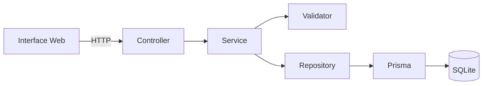
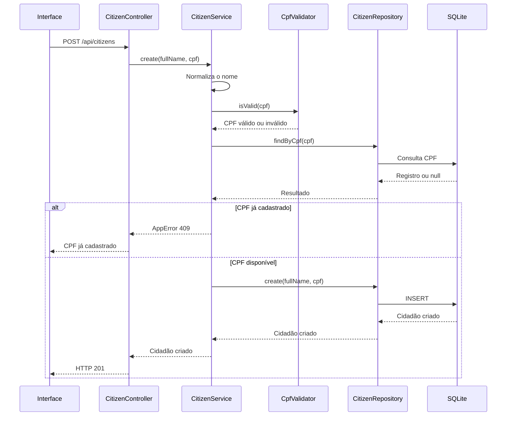
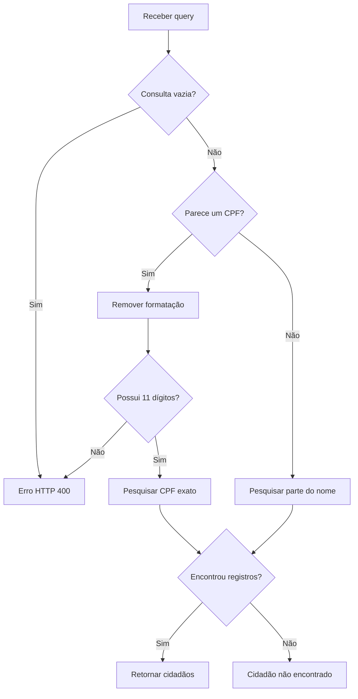

# Arquitetura da Aplicação

Este documento descreve a arquitetura, as principais classes, os métodos e o fluxo de execução da aplicação de cadastro de cidadãos.

O projeto foi organizado com foco em:

* separação de responsabilidades;
* orientação a objetos;
* baixo acoplamento;
* facilidade de manutenção;
* testabilidade;
* clareza do código.

## Visão geral

A aplicação possui uma interface web responsável por consumir uma API HTTP desenvolvida com Node.js, TypeScript e Express.

Os dados são persistidos em um banco SQLite por meio do Prisma ORM.



O backend foi dividido nas seguintes camadas:

| Camada     | Responsabilidade                               |
| ---------- | ---------------------------------------------- |
| Controller | Receber requisições HTTP e construir respostas |
| Service    | Executar as regras de negócio                  |
| Repository | Realizar operações de persistência             |
| Validator  | Validar o CPF                                  |
| Middleware | Tratar erros e requisições não reconhecidas    |
| Database   | Configurar e disponibilizar o Prisma Client    |

## Estrutura de diretórios

```text
src/
├── controllers/
│   └── CitizenController.ts
├── database/
│   └── prisma.ts
├── errors/
│   └── AppError.ts
├── generated/
│   └── prisma/
├── middlewares/
│   ├── errorHandler.ts
│   └── notFoundHandler.ts
├── repositories/
│   └── CitizenRepository.ts
├── routes/
│   └── citizenRoutes.ts
├── services/
│   └── CitizenService.ts
├── validators/
│   └── CpfValidator.ts
├── app.ts
└── server.ts
```

## Fluxo de cadastro

O cadastro é realizado pela rota:

```http
POST /api/citizens
```

O corpo da requisição deve conter:

```json
{
  "fullName": "Maria da Silva",
  "cpf": "529.982.247-25"
}
```

O fluxo interno é:



### Etapas do cadastro

1. O controller recebe `fullName` e `cpf`.
2. O service normaliza o nome.
3. O CPF é validado matematicamente.
4. A formatação do CPF é removida.
5. O repository verifica se o CPF já existe.
6. Caso não exista, o cidadão é persistido.
7. O controller devolve a mensagem de sucesso e os dados cadastrados.

## Fluxo de pesquisa

A pesquisa é realizada pela rota:

```http
GET /api/citizens?query=Maria
```

O parâmetro `query` pode conter um nome ou CPF.



Uma consulta composta somente por números, espaços, pontos e hífen é interpretada como CPF. As demais consultas são interpretadas como nome.

A pesquisa por CPF é exata. A pesquisa por nome utiliza correspondência parcial e pode retornar mais de um cidadão.

## Classes e responsabilidades

## `App`

Arquivo:

```text
src/app.ts
```

A classe `App` configura a aplicação Express.

### Propriedade `express`

```ts
public readonly express = express();
```

Armazena a instância do Express utilizada pelo servidor e pelos testes.

A propriedade é pública para permitir que o servidor inicialize a aplicação sem misturar a configuração das rotas com a abertura da porta HTTP.

### `constructor()`

Executa a configuração da aplicação na ordem correta:

1. configura opções gerais;
2. registra middlewares;
3. registra rotas;
4. registra os tratamentos de erro.

A ordem é importante porque os middlewares do Express são executados na mesma sequência em que são registrados.

### `configureApplication()`

Desabilita o cabeçalho:

```text
X-Powered-By: Express
```

A remoção evita expor desnecessariamente a tecnologia utilizada pelo servidor.

### `configureMiddlewares()`

Registra:

* leitura de requisições JSON;
* distribuição dos arquivos estáticos da pasta `public`.

### `configureRoutes()`

Registra:

* `GET /health`;
* as rotas de cidadãos em `/api/citizens`.

### `configureErrorHandling()`

Registra os middlewares de rota inexistente e tratamento de erros.

Eles são adicionados depois das rotas para que sejam executados somente quando uma requisição não for atendida normalmente.

## `CitizenController`

Arquivo:

```text
src/controllers/CitizenController.ts
```

O controller representa a camada de entrada da API.

Ele não contém regras de negócio nem realiza consultas diretamente no banco. Sua responsabilidade é receber dados HTTP, chamar o service e transformar o resultado em uma resposta.

### `create`

```ts
public create = async (
  request: Request,
  response: Response,
): Promise<Response>
```

Responsabilidades:

* obter `fullName` e `cpf` do corpo da requisição;
* chamar `CitizenService.create`;
* retornar o status `201 Created`;
* apresentar somente os dados necessários na resposta.

O método é definido como uma arrow function para preservar o contexto da instância quando é entregue diretamente ao Router do Express.

### `search`

```ts
public search = async (
  request: Request,
  response: Response,
): Promise<Response>
```

Responsabilidades:

* obter o parâmetro `query`;
* chamar `CitizenService.search`;
* devolver os cidadãos encontrados;
* retornar `404 Not Found` quando a lista estiver vazia.

## `CitizenService`

Arquivo:

```text
src/services/CitizenService.ts
```

O service concentra as regras de negócio da aplicação.

Essa classe não depende diretamente do Prisma. Ela depende do contrato `CitizenRepositoryContract`, permitindo que o repositório real seja substituído por uma implementação falsa durante os testes.

### Construtor

```ts
constructor(
  private readonly citizenRepository:
    CitizenRepositoryContract = new CitizenRepository(),
)
```

Por padrão, a aplicação utiliza `CitizenRepository`.

Nos testes, uma instância de `FakeCitizenRepository` pode ser fornecida:

```ts
const repository = new FakeCitizenRepository();
const service = new CitizenService(repository);
```

Esse mecanismo é uma forma de injeção de dependência.

### `create`

```ts
public async create(input: CreateCitizenInput)
```

Executa o cadastro de um cidadão.

Responsabilidades:

* validar e normalizar o nome;
* validar o CPF;
* remover sua formatação;
* verificar duplicidade;
* solicitar a persistência ao repository.

Erros possíveis:

| Situação      | Status |
| ------------- | -----: |
| Nome ausente  |    400 |
| Nome inválido |    400 |
| CPF ausente   |    400 |
| CPF inválido  |    400 |
| CPF duplicado |    409 |

### `search`

```ts
public async search(query: unknown)
```

Pesquisa cidadãos por nome ou CPF.

Responsabilidades:

* rejeitar consultas vazias;
* normalizar espaços;
* identificar o tipo da consulta;
* normalizar o CPF pesquisado;
* chamar o método apropriado do repository.

O resultado é sempre uma lista. Mesmo a pesquisa por CPF retorna uma lista com zero ou um elemento. Isso simplifica o tratamento no controller e no frontend.

### `normalizeFullName`

```ts
private normalizeFullName(value: unknown): string
```

Valida e normaliza o nome completo.

O método:

* exige que o valor seja uma string;
* remove espaços nas extremidades;
* substitui espaços consecutivos por um único espaço;
* exige pelo menos três caracteres.

Exemplo:

```text
"  Maria   da Silva  "
```

torna-se:

```text
"Maria da Silva"
```

### `validateAndNormalizeCpf`

```ts
private validateAndNormalizeCpf(value: unknown): string
```

Valida o valor recebido e devolve o CPF contendo somente números.

Exemplo:

```text
529.982.247-25
```

torna-se:

```text
52998224725
```

O método utiliza `CpfValidator` para validar os dígitos verificadores.

## `CitizenRepository`

Arquivo:

```text
src/repositories/CitizenRepository.ts
```

O repository isola o restante da aplicação dos detalhes de persistência.

Caso o Prisma ou o SQLite fossem substituídos, a maior parte da aplicação não precisaria ser alterada.

### `CitizenRepositoryContract`

Define as operações que uma implementação de repositório precisa oferecer:

```ts
export interface CitizenRepositoryContract {
  create(data: CreateCitizenData): Promise<CitizenRecord>;
  findByCpf(cpf: string): Promise<CitizenRecord | null>;
  findByName(name: string): Promise<CitizenRecord[]>;
}
```

Esse contrato é utilizado pelo service e pelo repositório falso dos testes.

### `create`

```ts
public async create(
  data: CreateCitizenData,
): Promise<CitizenRecord>
```

Insere um cidadão no banco e retorna o registro criado.

### `findByCpf`

```ts
public async findByCpf(
  cpf: string,
): Promise<CitizenRecord | null>
```

Pesquisa um cidadão por CPF.

O método utiliza uma consulta de valor único porque o campo `cpf` possui a restrição `@unique` no schema do Prisma.

### `findByName`

```ts
public async findByName(
  name: string,
): Promise<CitizenRecord[]>
```

Realiza uma busca parcial pelo nome e ordena os resultados alfabeticamente.

## `CpfValidator`

Arquivo:

```text
src/validators/CpfValidator.ts
```

A classe é responsável exclusivamente pela validação e normalização do CPF.

Seus métodos são estáticos porque a classe não possui estado interno e não precisa ser instanciada.

### `normalize`

```ts
public static normalize(cpf: string): string
```

Remove todos os caracteres que não sejam números.

Exemplo:

```text
529.982.247-25
```

torna-se:

```text
52998224725
```

### `isValid`

```ts
public static isValid(cpf: string): boolean
```

Verifica:

1. se o CPF possui 11 dígitos;
2. se não é uma sequência repetida;
3. se o primeiro dígito verificador está correto;
4. se o segundo dígito verificador está correto.

Exemplos de sequências rejeitadas:

```text
000.000.000-00
111.111.111-11
999.999.999-99
```

### `calculateVerifierDigit`

```ts
private static calculateVerifierDigit(
  digits: number[],
  initialWeight: number,
): number
```

Calcula um dígito verificador do CPF usando os pesos definidos pelo algoritmo oficial.

O método é privado porque representa um detalhe interno da validação e não deve ser chamado diretamente por outras partes da aplicação.

## `AppError`

Arquivo:

```text
src/errors/AppError.ts
```

Representa erros esperados das regras da aplicação.

```ts
export class AppError extends Error {
  constructor(
    public readonly message: string,
    public readonly statusCode: number,
  )
}
```

Além da mensagem, o erro carrega o status HTTP que deve ser devolvido.

Exemplo:

```ts
throw new AppError("CPF já cadastrado.", 409);
```

O uso de uma classe específica permite distinguir erros esperados de falhas inesperadas do servidor.

## `errorHandler`

Arquivo:

```text
src/middlewares/errorHandler.ts
```

Middleware centralizado de tratamento de erros.

Ele reconhece três categorias:

### Erros da aplicação

Erros criados com `AppError` são devolvidos com a mensagem e o status definidos pela regra de negócio.

### Violação de unicidade

O Prisma utiliza o código `P2002` quando uma restrição única é violada.

Mesmo que duas requisições tentem cadastrar o mesmo CPF simultaneamente, a restrição do banco continua protegendo os dados.

Nesse caso, o middleware devolve:

```http
HTTP/1.1 409 Conflict
```

```json
{
  "message": "CPF já cadastrado."
}
```

### Erros inesperados

Erros não reconhecidos são registrados no console e resultam em:

```http
HTTP/1.1 500 Internal Server Error
```

```json
{
  "message": "Ocorreu um erro interno no servidor."
}
```

Detalhes internos não são enviados ao cliente.

## `notFoundHandler`

Arquivo:

```text
src/middlewares/notFoundHandler.ts
```

É executado quando nenhuma rota anterior reconhece a requisição.

Retorna:

```http
HTTP/1.1 404 Not Found
```

```json
{
  "message": "Rota não encontrada."
}
```

## `prisma`

Arquivo:

```text
src/database/prisma.ts
```

Configura o acesso ao banco de dados.

O arquivo:

1. carrega as variáveis de ambiente;
2. verifica se `DATABASE_URL` foi definida;
3. cria o adaptador do SQLite;
4. instancia o Prisma Client;
5. exporta uma única instância compartilhada.

A utilização de uma única instância evita a criação desnecessária de múltiplas conexões.

## `server`

Arquivo:

```text
src/server.ts
```

É o ponto de entrada da aplicação.

Responsabilidades:

* instanciar `App`;
* determinar a porta;
* iniciar o servidor HTTP.

A porta pode ser definida pela variável de ambiente `PORT`. Caso não seja informada, a aplicação utiliza a porta `3000`.

A separação entre `server.ts` e `app.ts` permite configurar e testar a aplicação sem iniciar obrigatoriamente uma porta de rede.

## Rotas

Arquivo:

```text
src/routes/citizenRoutes.ts
```

As rotas associam os caminhos HTTP aos métodos do controller:

| Método | Caminho         | Ação                                |
| ------ | --------------- | ----------------------------------- |
| POST   | `/api/citizens` | Cadastrar cidadão                   |
| GET    | `/api/citizens` | Pesquisar cidadãos                  |
| GET    | `/health`       | Verificar funcionamento do servidor |

O Router não contém regras de negócio. Ele apenas conecta os endpoints aos métodos correspondentes.

## Persistência

O modelo do Prisma está definido em:

```text
prisma/schema.prisma
```

O cidadão possui os seguintes campos:

```prisma
model Citizen {
  id        Int      @id @default(autoincrement())
  fullName  String
  cpf       String   @unique
  createdAt DateTime @default(now())
  updatedAt DateTime @updatedAt
}
```

### `id`

Identificador interno, numérico e auto incremental.

### `fullName`

Nome completo normalizado do cidadão.

### `cpf`

CPF armazenado somente com números.

A restrição `@unique` impede duplicidade no nível do banco de dados.

### `createdAt`

Data e hora de criação do registro.

### `updatedAt`

Data e hora da última atualização.

## Testes automatizados

Os testes utilizam Vitest e estão organizados em:

```text
tests/
├── fakes/
│   └── FakeCitizenRepository.ts
└── unit/
    ├── CitizenService.test.ts
    └── CpfValidator.test.ts
```

## `FakeCitizenRepository`

É uma implementação em memória do contrato `CitizenRepositoryContract`.

Em vez de utilizar SQLite, os registros são mantidos em um array durante o teste.

Isso permite testar o service:

* sem criar banco;
* sem aplicar migrations;
* sem depender do Prisma;
* com execução rápida e determinística.

## Testes de `CpfValidator`

Cobrem os seguintes cenários:

* CPF válido com formatação;
* CPF válido sem formatação;
* dígitos verificadores incorretos;
* quantidade incorreta de dígitos;
* sequências repetidas;
* entrada vazia;
* remoção da formatação.

## Testes de `CitizenService`

Cobrem os seguintes cenários:

* cadastro válido;
* normalização do nome;
* normalização do CPF;
* nome inválido;
* CPF inválido;
* CPF duplicado;
* pesquisa por CPF;
* pesquisa parcial por nome;
* cidadão inexistente;
* pesquisa vazia;
* pesquisa numérica com tamanho inválido.

## Frontend

Os arquivos da interface estão na pasta:

```text
public/
├── app.js
├── index.html
└── styles.css
```

O frontend utiliza HTML, CSS e JavaScript sem framework.

Essa escolha mantém o escopo simples e evita adicionar dependências desnecessárias para uma interface composta por dois formulários.

### Cadastro

O formulário envia uma requisição `POST` para `/api/citizens`.

Durante a requisição:

* o botão é desabilitado;
* seu texto é alterado;
* a resposta da API é interpretada;
* o resultado é exibido na tela.

### Pesquisa

O formulário envia uma requisição `GET` para `/api/citizens`, utilizando `URLSearchParams` para construir o parâmetro de consulta.

### Segurança de renderização

Os dados recebidos são adicionados ao documento utilizando `textContent`, e não `innerHTML`.

Isso evita interpretar como HTML os valores fornecidos pelo usuário.

## Decisões arquiteturais

## Separação em camadas

As responsabilidades foram divididas para evitar classes que conheçam detalhes demais.

O controller não conhece o Prisma. O repository não valida CPF. O validator não conhece requisições HTTP.

## Injeção de dependência

`CitizenService` depende de um contrato, e não exclusivamente do repositório concreto.

Isso reduz o acoplamento e facilita testes.

## Restrição de unicidade em duas camadas

A duplicidade é verificada pelo service para produzir uma mensagem amigável.

O banco também possui uma restrição única, garantindo integridade mesmo em situações concorrentes.

## CPF armazenado sem formatação

A aplicação aceita CPF com ou sem formatação, mas o banco armazena somente os 11 números.

Essa decisão evita que o mesmo CPF seja armazenado em formatos diferentes.

A formatação é aplicada apenas para apresentação na interface.

## Uso de SQLite

O SQLite não exige a instalação de um servidor separado.

Isso torna a execução simples para o avaliador e é suficiente para o escopo proposto.

## Ausência de comentários redundantes

O código prioriza nomes descritivos de classes, métodos e variáveis.

Comentários que apenas repetiriam uma instrução foram evitados. As decisões arquiteturais e os fluxos menos óbvios são documentados neste arquivo.

Essa abordagem mantém o código limpo sem abrir mão da documentação técnica.

## Possíveis evoluções

Em uma versão futura, a aplicação poderia receber:

* paginação da pesquisa;
* edição e exclusão de cidadãos;
* autenticação e autorização;
* logs estruturados;
* documentação OpenAPI/Swagger;
* testes de integração HTTP;
* testes de interface;
* container Docker;
* normalização adicional dos nomes;
* pesquisa sem diferenciação de acentos;
* configuração específica para ambientes de produção.
